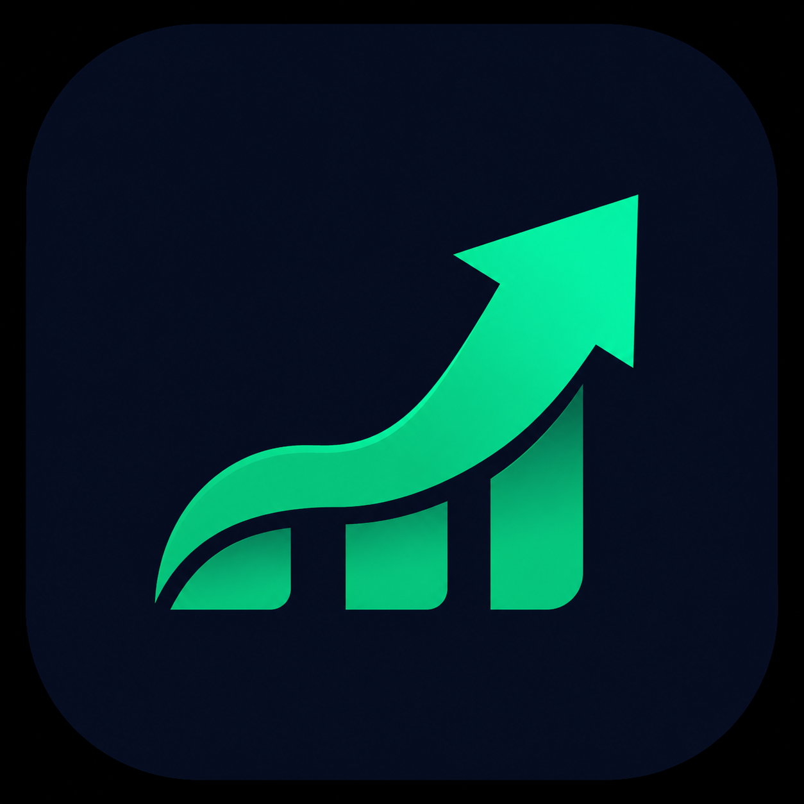

<div align="center">



# Budget Flow

**Budget once. Track forever.**

[](https://DamienSmith428.github.io/BudgetFlow-web/)
[](https://github.com/DamienSmith428/BudgetFlow-web/releases/latest)
[](LICENSE)
[](https://DamienSmith428.github.io/BudgetFlow-web/)
[](https://DamienSmith428.github.io/SideStack-web/)

[**→ View App Page**](https://DamienSmith428.github.io/BudgetFlow-web/) · [**↓ Download**](https://github.com/DamienSmith428/BudgetFlow-web/releases/latest) · [**Changelog**](https://DamienSmith428.github.io/BudgetFlow-web/changelog.html) · [**Privacy Policy**](https://DamienSmith428.github.io/BudgetFlow-web/privacy.html)

</div>

---

## About

BudgetFlow is a personal budgeting app that does the heavy lifting for you. Set up your income, bills, and subscriptions once — and BudgetFlow automatically tracks your financial picture every month. Watch your savings grow, spot spending trends, and see your full financial history at a glance.

---

## Download

Head to the [**latest release**](https://github.com/DamienSmith428/BudgetFlow-web/releases/latest) and grab the APK for your device architecture.

| Architecture | Who it's for |
|---|---|
| `Universal` | Works on all supported Android devices — **recommended** |

> **Not sure which to pick?** Grab `arm64-v8a` — it covers most Android phones from 2016 and newer.

---

## Installation

1. Download the APK for your architecture above
2. Open the APK on your device
3. Allow installation from unknown sources if prompted
4. Install and enjoy

---

## Privacy

Budget Flow collects no data. No analytics, no telemetry, no accounts. Everything stays on your device. [Full privacy policy →](https://DamienSmith428.github.io/BudgetFlow-web/privacy.html)

---

## Distributed via SideStack

This app is part of [SideStack](https://DamienSmith428.github.io/SideStack-web/) — an independent Android app store built outside the Play Store ecosystem.

---

## 📬 Get This App Listed in the SideStack Store

If you built this app using the SideStack Tool and want it to appear in the SideStack Android store, copy the config URL below and send it to **[@DamienSmith428](https://github.com/DamienSmith428)** — open an issue or reach out directly on GitHub.

```
https://raw.githubusercontent.com/DamienSmith428/BudgetFlow-web/main/docs/config.json
```

Once added, your app will appear automatically in the SideStack store app for all users.

---

<div align="center">
<sub>Built by <a href="https://github.com/DamienSmith428">DamienSmith428</a> ·  License</sub>
</div>
